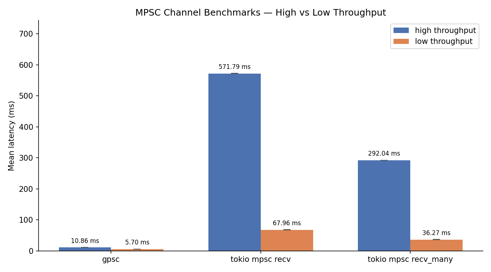

# A channel for *lots* of producer

This channel works similarly to tokio's MSPC channel with one trick up it's sleeve.

Instead of reading message one at a time, it can clear the entire channel in a single operation by flipping the pointer between two buffer, making it really efficient in situations where you need backpressure and have a large amount of producer and a single consumer.

this library was inspired by this [article](https://blog.digital-horror.com/blog/how-to-avoid-over-reliance-on-mpsc/)

## Quick Start

```Rust
use gpsc_channel::channel;

#[tokio::main]
async fn main() {
    let (tx, rx) = channel::<Vec<String>>(100);

    let mut task_handles = vec![];

    for _ in 0..100 {
        let tx_clone = tx.clone();

        task_handles.push(tokio::spawn(async move {
            let data = String::from("hello");
            let _ = tx_clone.send(data).await;
        }));
    }

    for handle in task_handles {
        let _ = handle.await;
    }

    let mut rcv_buf = Vec::with_capacity(100);
    let n = rx.take(&mut rcv_buf).await.unwrap();

    assert_eq!(n, 100)
}
```

### Container

Unlike regular channels, this channel is generic over a container that holds the type of message you want to send.

This library exposes the `GpscContainer` trait which is implemented for all the standard library collections.

## Benchmarks


The reason this channel can be so much faster is two fold:
- avoiding the overhead of repeated calls to `recv()`
- using more efficient data structures: tokio's channel uses a linked list for its underlying memory
